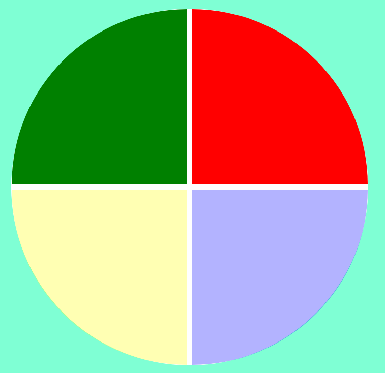

# Jogo Genius desenvolvido no bootcamp Javascript game Developer na plataforma Digital Innovation One.

## O projeto foi desenvolvido utilizando HTML, CSS e Javascript.

O jogo é um desafio de memória sequencial, onde temos um circulo dividido em 4 quadrantes. 
Os quadrantes vão se acendendo de forma ordenada e o objetivo é clicar na sequência de cores conforme elas forem surgindo.

Foi utlizado CSS grid para fazer a divisão dos quadrantes e o efeito de luz acesa foi construído usando a propriedade CSS de opacidade.

A ordem de acendimento das luzes foi feita gerando-se um número aleatório de 1 a 4 e armazenando em um array.

Os cliques dos usuário também são armazenados em um array para comparar com a ordem de acendimento.

